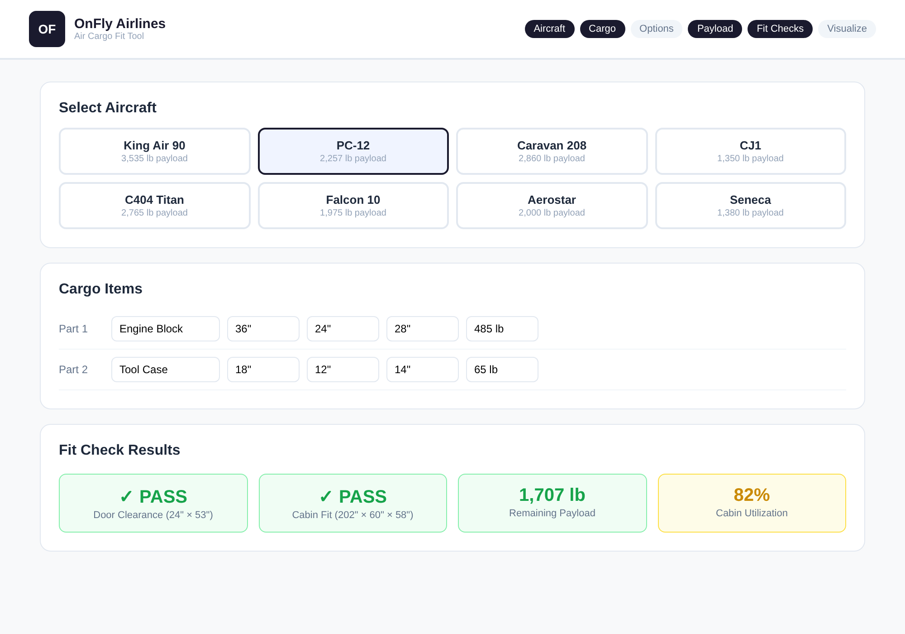

# FlyFit Buddy

**Air cargo fit calculator that checks whether cargo physically fits through aircraft doors and cabins — with real specs for 14+ aircraft types.**

Built for [OnFly Air](https://onflyair.com), our on-demand air charter brokerage, to streamline cargo planning for brokers who need fast answers on whether a shipment will work on a given aircraft.

<p align="center">
  
</p>

---

## What It Does

Select an aircraft, enter your cargo dimensions, and FlyFit Buddy instantly tells you:

- **Door clearance** — will the cargo physically fit through the aircraft door?
- **Cabin fit** — does it fit inside the cabin once loaded?
- **Payload check** — is the total weight within limits (including mechanics, tools, and seat removal)?
- **Visual layout** — 2D visualization of cargo placement in the cabin

The tool includes a database of real aircraft specs (King Air 90, PC-12, Caravan 208, CJ1, and more) with accurate door dimensions, cabin measurements, max payload, and seat configurations.

## Why I Built It

In charter brokerage, the first question is always "will it fit?" Brokers were manually looking up specs and doing mental math for every quote. This tool turns a 10-minute phone-call-and-spreadsheet process into a 30-second answer.

## Tech Stack

React · TypeScript · Vite · Tailwind CSS · shadcn/ui

## Run Locally

```sh
npm install
npm run dev
```

---

*Built by [Paige Miller](https://github.com/paige-millz) for [OnFly Air](https://onflyair.com)*
